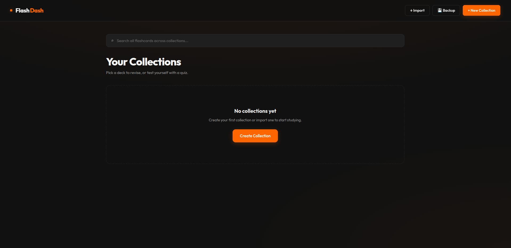
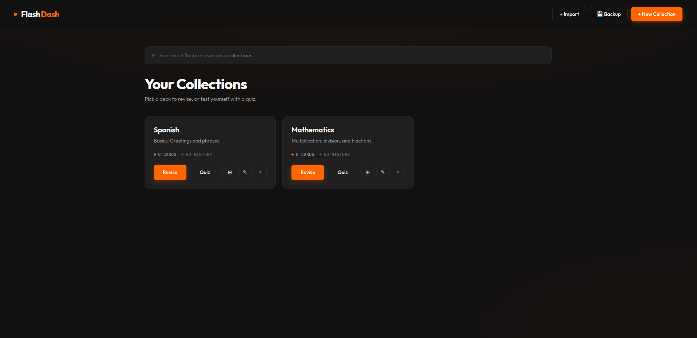
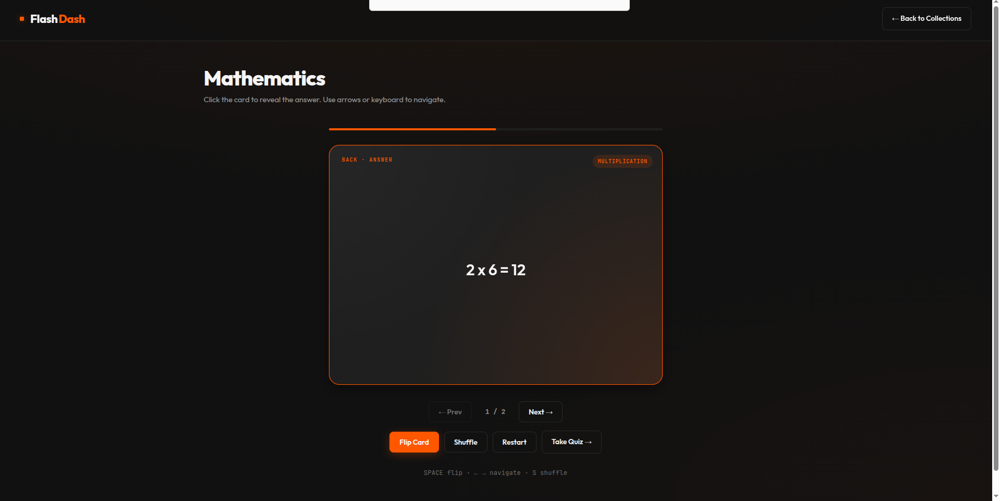
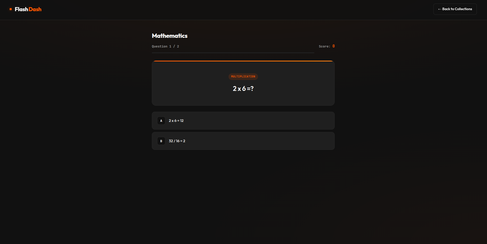
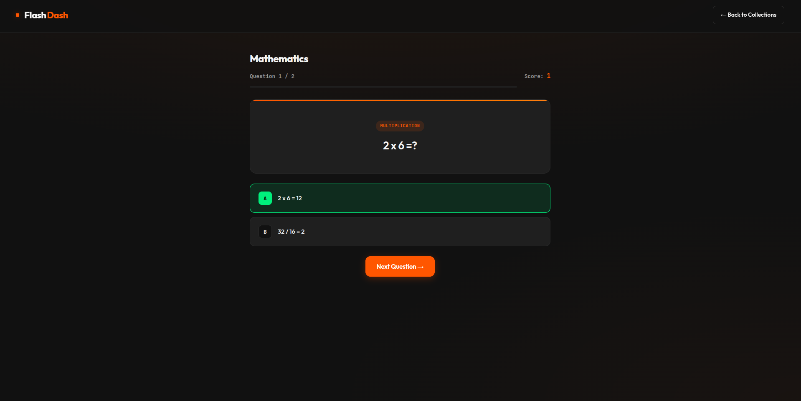
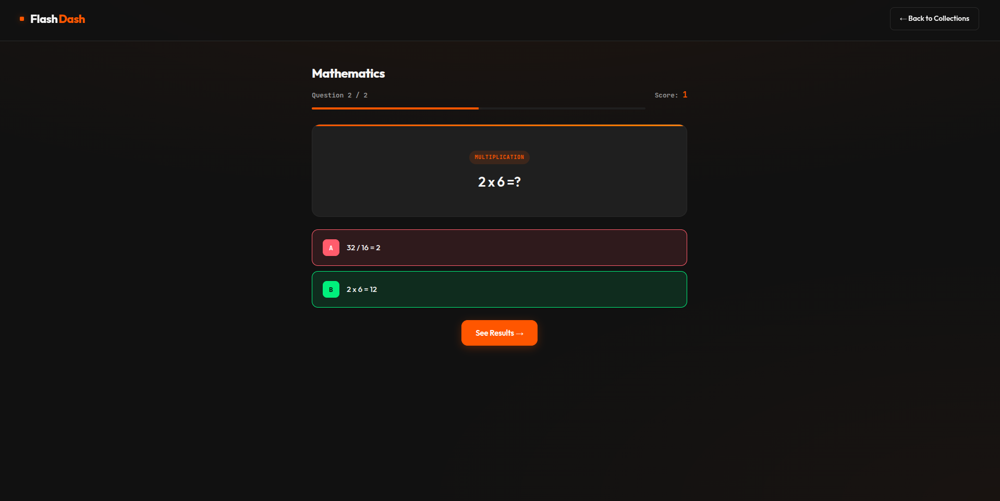
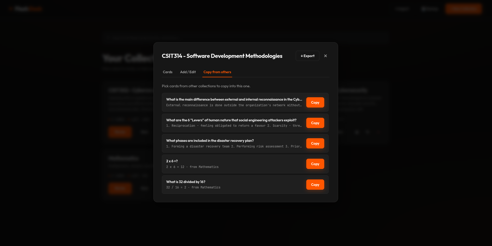
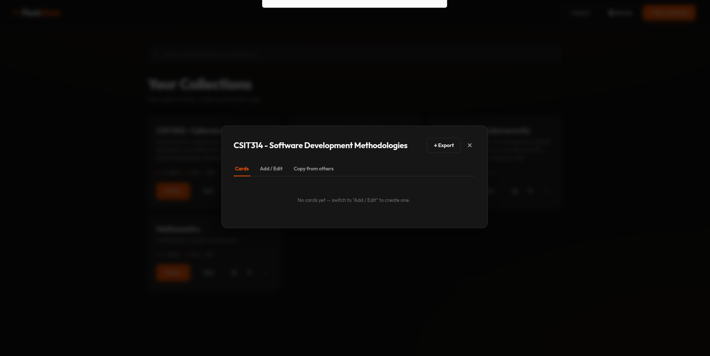
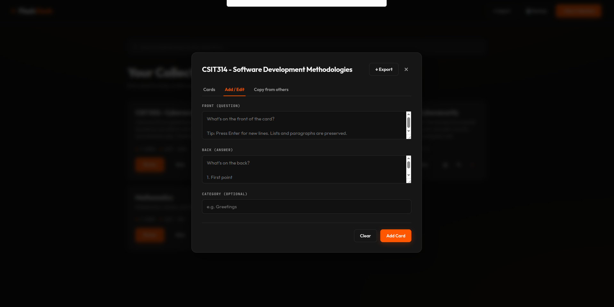

# FlashDash

  
**A clean, fast, and fully offline flashcard app.**

---

### Study smarter. Revise faster.

FlashDash is a beautiful, minimalist flashcard application built for students, professionals, and lifelong learners. Create collections, flip cards, test yourself with quizzes, and never lose your progress.






---

## ✨ Features

- **Organized Collections** — Group your flashcards with titles and descriptions
- **Two Study Modes**:
  - **General Revise** — Smooth card flipping with difficulty rating
  - **Quiz Mode** — Scored testing with results and review
- **Global Search** — Find any card across all collections instantly
- **Full Card Management** — Create, edit, delete, and copy cards between collections
- **Import & Export** — Backup and restore your collections
- **Automatic Backups** — Protects your data from accidental cache clearing
- **Beautiful Dark UI** — Modern black + orange design with smooth animations
- **Fully Offline** — Works 100% in your browser









---

## How to Use

1. **Create a Collection**
   - Click **"+ New Collection"**
   - Give it a title and description
   - Start adding flashcards

2. **Add Flashcards**
   - Open a collection → Go to "Manage Cards"
   - Write your question (front) and answer (back)
   - Supports line breaks, numbered lists, and paragraphs

3. **Study**
   - Click **"Revise"** to flip through cards at your own pace
   - Click **"Quiz"** to test yourself under pressure

4. **Backup Your Data**
   - Use the **💾 Backup** button regularly
   - Auto-backups are created when you add collections or cards

---

## How to Run Locally

1. Clone the repository:
   ```bash
   git clone https://github.com/Mr-Shoznum/flashdash.git

---

## Improvements

1. Auto backup is too invasive
2. Clicking a collection should expand the view showing more info and options
3. Remove collection delete from the front page
4. Add a 3D graph showing knowledge connections between collections and cards
